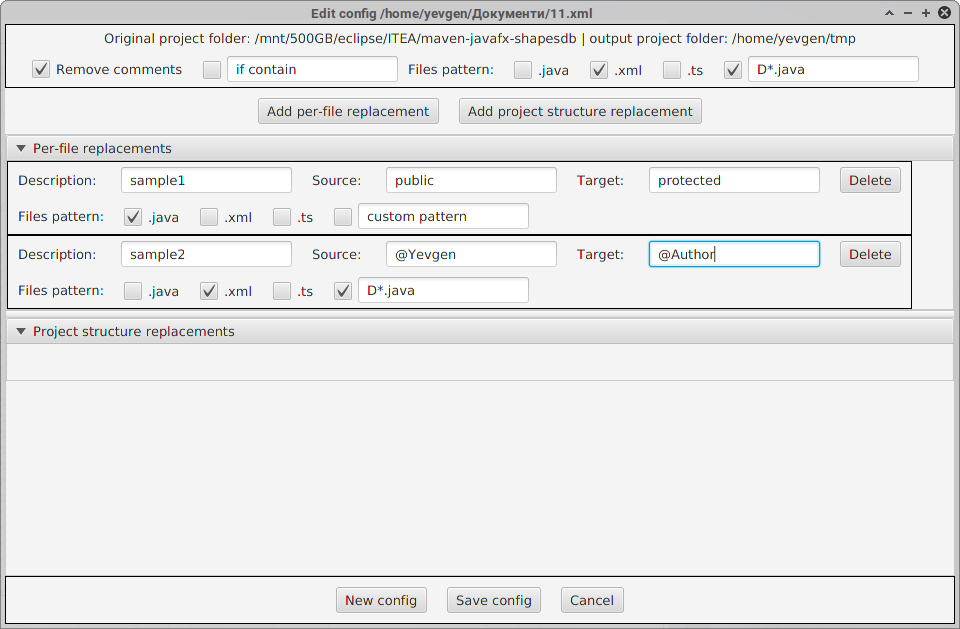

# Code sanitizer tool (made with Java 8 / JavaFX / XML)

Java-written, speed-driven application for batch code refactor in [Maven](https://maven.apache.org/) and [Angular](https://angular.io/) projects

## Installation and run (tested on Linux / Windows)

* Clone current git repository to local machine

`git clone https://github.com/evgenpatiy/code-sanitizer.git`

* Compile source code using command below. Warning: existing [Java 8](https://java.com/en/download/) and [Maven](https://maven.apache.org/) installation required!
   
`mvn clean compile assembly:single` 

* "target" directory will be created, find **sanitizer-1.0-SNAPSHOT-jar-with-dependencies.jar** inside and run application as per below, or just double-click on it, if your
operating system supports it

`java -jar sanitizer-1.0-SNAPSHOT-jar-with-dependencies.jar`

## Usage

## Author

- Yevgen Patiy

## License

Feel free to use, modify or distribute this software. This project is licensed under the [GNU GPL 2.0 license](https://www.gnu.org/licenses/old-licenses/gpl-2.0.uk.html).
